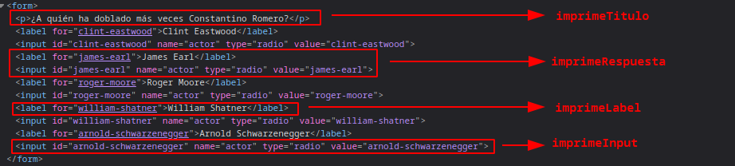

# :shinto_shrine: - Constantino Romero #

## Introducción ##


Constantino Romero García fue un presentador, locutor y actor de doblaje español.

En su voz han sonado míticas frases del cine mundial, como: "No, yo soy tu padre" pronunciada por James Earl Jones en El imperio contraataca; "Yo, he visto cosas que vosotros no creeríais...", por Rutger Hauer en el famoso discurso final de Blade Runner; "Volveré", pronunciada por Arnold Schwarzenegger en Terminator; "Me llamo Bond, James Bond", interpretando a Roger Moore. También realizó el doblaje de célebres personajes de películas de Disney como Claude Frollo en El jorobado de Notre Dame, Shere Khan en El libro de la selva, y el impertérrito Mufasa en El Rey León, el trabajo que más le conmovió.

## Requisitos ##

- Fundamentos de programación
- Arrays
- Funciones
- Objetos
- Strings

## Iteraciones ##

Clona este repositorio para poder trabajar de modo local.


Tienes el siguiente objeto, que representa una pregunta cualquiera:

```javascript
const pregunta = {
  titulo: '¿A quién ha doblado más veces Constantino Romero?',
  respuestas: [
    {
      label: "Clint Eastwood",
      id: "clint-eastwood",
      name: "actor",
      value: "clint-eastwood"
    },
    {
      label: "James Earl",
      id: "james-earl",
      name: "actor",
      value: "james-earl"
    },
    {
      label: "Roger Moore",
      id: "roger-moore",
      name: "actor",
      value: "roger-moore"
    },
    {
      label: "William Shatner",
      id: "william-shatner",
      name: "actor",
      value: "william-shatner"
    },
    {
      label: "Arnold Schwarzenegger",
      id: "arnold-schwarzenegger",
      name: "actor",
      value: "arnold-schwarzenegger"
    }
  ]
}
```

Queremos convertir dicha pregunta en lo siguiente:

```javascript
    <form id="contenedorPreguntas">
        <p>¿A quién ha doblado más veces Constantino Romero?</p>
        <label for="clint-eastwood">Clint Eastwood</label>
        <input id="clint-eastwood" name="actor" type="radio" value="clint-eastwood">
        <label for="james-earl">James Earl</label>
        <input id="james-earl" name="actor" type="radio" value="james-earl">
        <label for="roger-moore">Roger Moore</label>
        <input id="roger-moore" name="actor" type="radio" value="roger-moore">
        <label for="william-shatner">William Shatner</label>
        <input id="william-shatner" name="actor" type="radio" value="william-shatner">
        <label for="arnold-schwarzenegger">Arnold Schwarzenegger</label>
        <input id="william-shatner" name="actor" type="radio" value="arnold-schwarzenegger">
    </form>
```



El primer paso es identificar que usaremos una función que, usando la variable `pregunta` como argumento, transformará un objeto en HTML. Dicha función ya está nombrada y se llamará `imprimePregunta`.

El proceso sería el siguiente: `pregunta` -> `imprimePregunta(pregunta)` -> `HTML`

Rellena las funciones siguientes:

- `imprimeTitulo`: Recibe un **objeto pregunta** y devuelve **un string** con el título de la misma dentro de un `<p>`

- `imprimeTodasLasRespuestas`: Recibe un **objeto pregunta** y devuelve **un string** con todas las posibles respuestas. Para ello, esta función llama a las funciones siguientes:

  - `imprimeUnaRespuesta`: Recibe un **objeto respuesta** y devuelve **un string** compuesto del resultado de las dos siguientes funciones:

    - `imprimeLabel`: Recibe un **objeto respuesta** y devuelve **un string** que representa una etiqueta `<label>` cuyo atributo `for` tendrá el valor de la propiedad `id` del objeto respuesta, y el texto que contiene dicho `<label>` tendrá el valor de la propiedad `label` del objeto respuesta.

    - `imprimeInput`: Recibe un **objeto respuesta** y devuelve **un string** que representa una etiqueta `<input>` de tipo "radio", cuyos atributos `id`, `name` y `value` tendrán el valor de las propiedades `id`, `name` y `value` del objeto respuesta, respectivamente.
